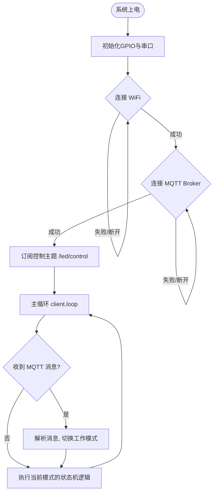

# 🚀 ESP8266 双 LED 物联网 MQTT 控制系统开发规划书

本项目基于 ESP8266 开发板，通过 WiFi 连接网络，使用 MQTT 协议订阅指定主题，接收控制命令以实现对绿灯（D1）和红灯（D2）的多种工作模式（同闪、绿闪、红闪、绿常亮、红常亮、全灭等）的远程无阻塞控制。

---

## 📌 一、 硬件与引脚定义

| 物理标识 | 单片机引脚 (Arduino Pin) | GPIO 编号 | 硬件连接说明 |
| :--- | :--- | :--- | :--- |
| **D1 (绿灯)** | `D1` | `GPIO5` | 接 LED 阳极（高电平点亮），需串联 220Ω 限流电阻 |
| **D2 (红灯)** | `D2` | `GPIO4` | 接 LED 阳极（高电平点亮），需串联 220Ω 限流电阻 |

> [!WARNING]
> ESP8266 的 GPIO 引脚在上电瞬间有不同的初始电平状态。`GPIO4` (D2) 和 `GPIO5` (D1) 属于上电安全的普通输入/输出引脚，非常适合用于控制 LED，不会影响开发板的正常启动。

---

## 🌐 二、 软件架构与无阻塞设计

为了保证 MQTT 客户端能够保持稳定的心跳连接并即时响应控制命令，程序中**严禁使用阻塞式的 `delay()` 函数**。我们将采用 `millis()` 软件定时器配合**有限状态机 (FSM)** 的机制来实现灯光的闪烁与常亮。



---

## 💬 三、 MQTT 通信协议设计

为了便于后续扩展和第三方平台（如 Node-RED、手机 App 或 Home Assistant）对接，我们设计两种命令格式：

### 1. 简易字符串格式 (巴法云平台实装)
* **订阅控制主题 (Topic)**: `DveTUhQQg002` (您的巴法云设备主题)
* **发布状态主题 (Topic)**: `DveTUhQQg002/up` (设备状态反馈，只更新后台不广播)
* **控制指令负载 (Payload - 文本格式)**:
  * **基础控制与常亮模式**：
    * `0` 或 `off`: **全灭** (Both Off)
    * `1`: **同闪** (Both Flash)
    * `2`: **绿灯闪，红灯灭** (Green Flash)
    * `3`: **红灯闪，绿灯灭** (Red Flash)
    * `4` 或 `on`: **绿灯常亮，红灯灭** (Green On)
    * `5`: **红灯常亮，绿灯灭** (Red On)
    * `6`: **双灯常亮** (Both On)
  * **高级极客灯语模式**：
    * `7`: **警车交替快闪** (Police Alternate Flash)
    * `8`: **科技感心跳双闪** (Heartbeat Pulse)
    * `9`: **SOS 国际求救信号** (SOS Morse Code)
    * `10`: **交替柔和呼吸灯** (Breathing Alternate)
  * **中高阶仿真与物理效果模式**：
    * `11`: **双萤火虫混沌呼吸** (Firefly Swarm)
    * `12`: **医疗监护心电图波形** (ECG Simulation)
    * `13`: **安全守护滴答倒计时** (Tick-Tock Warning)
    * `14`: **正余弦跑马旋转霓虹** (Phase-Shift Chase)
    * `15`: **急救车高速爆闪追击** (Strobe Chase)
    * `16`: **太极阴阳双鱼呼吸** (Tai-Chi S-curve)
    * `17`: **"HELLO" 摩尔斯单词广播** ("HELLO" Morse Broadcast)
    * `18`: **雷达扫描与目标锁定** (Radar Scan & Lock)
  * **⏱️ 动态时间/频率控制指令**：
    * 发送格式为 **`i<毫秒数>`** (不区分大小写，如 `i60`、`i1200`、`I500`)：
      * 动态将全局闪烁、警车交替、相位旋转等模式的闪烁周期或变换频率修改为指定的毫秒数（支持范围：`30`ms ~ `10000`ms）。

### 2. JSON 格式 (设计预留)
* **控制负载示例**:
  ```json
  {
    "mode": "green_flash",
    "interval": 500
  }
  ```

---

## 🛠️ 四、 状态机设计与模式定义

我们定义以下 6 种运行状态（用 C++ `enum` 表达）：

enum LedMode {
  MODE_BOTH_OFF = 0,    // 0: 全灭
  MODE_BOTH_FLASH,      // 1: 同闪
  MODE_GREEN_FLASH,     // 2: 绿灯闪，红灯灭
  MODE_RED_FLASH,       // 3: 红灯闪，绿灯灭
  MODE_GREEN_ON,        // 4: 绿灯常亮，红灯灭
  MODE_RED_ON,          // 5: 红灯常亮，绿灯灭
  MODE_BOTH_ON,         // 6: 双灯常亮
  MODE_POLICE_ALT,      // 7: 红绿警车交替快闪 (警示灯语)
  MODE_HEARTBEAT,       // 8: 科技感双灯心跳双闪 (心跳灯语)
  MODE_SOS,             // 9: SOS 国际求救信号灯语 (求救灯语)
  MODE_BREATHING,       // 10: 红绿交替柔和呼吸灯 (交替无级调光)
  MODE_FIREFLY,         // 11: 夏夜双萤火虫自然混沌呼吸 (非对称双频正弦)
  MODE_ECG,             // 12: 医疗监护仪心电波模拟 (红灯ECG，绿灯血氧同步)
  MODE_TICKTOCK,        // 13: 安全防护摆钟滴答计时 (绿常亮，红灯秒级短脉冲)
  MODE_PHASE_CHASE,     // 14: 正余弦跑马旋转霓虹灯 (90度相位差交错变光)
  MODE_STROBE_CHASE,    // 15: 特种爆闪追击爆裂灯语 (绿3爆闪 -> 停顿 -> 红3爆闪)
  MODE_TAICHI,          // 16: 🌟 新增：太极阴阳双鱼呼吸 (三阶正弦S形柔滑转换)
  MODE_HELLO_MORSE,     // 17: 🌟 新增：极客问候语 "HELLO" 摩尔斯广播 (单词高精度序列电码)
  MODE_RADAR            // 18: 🌟 新增：科幻雷达扫描与锁定警告 (绿灯缓慢扫描，红灯突发暴烈锁定)
};
```

---

## ✨ 五、 新增高级功能设计：动态时间与灯语效果

为了提供极具交互感和极客风格的体验，我们为系统追加两大拓展核心：

### 1. ⏱️ 动态时间控制 (控制端下发参数调整速度)
由于巴法云发送的是纯文本数据，为了不需要引入沉重的 JSON 库，我们设计了**前缀匹配解析器**：
* 如果收到以字符 **`i`** 开头的控制命令（例如：`i200`，`i1500`）：
  * 提取 `i` 之后的数字并进行数值转换。
  * 将 `flashInterval`（闪烁间隔时间）修改为该数值。
  * 从而实现了通过巴法云平台**随时随地动态改变所有闪烁模式的频率**（快闪/慢闪）。

### 2. 🎭 高级创意灯语与仿真模式表 (更新至19种)
我们将通过非阻塞式的软件步进器和 ESP8266 特有的高精度 PWM (`analogWrite`)，在不引入 `delay()` 的前提下实现：

| 模式编号 | 模式名称 | 视觉与灯语逻辑描述 | 物理层硬件实现方式 |
| :--- | :--- | :--- | :--- |
| **7** | **警车交替快闪** | 绿灯与红灯以极快的速度交替闪烁，营造强烈的紧急警示感。 | 数字引脚高低电平交替输出 |
| **8** | **科技感心跳双闪** | 模仿真实心脏跳动的律动感：双灯连续快闪两次，然后进入长间歇。 | 软件状态计数器配合时间戳 |
| **9** | **SOS 国际求救** | 严格按照摩尔斯电码 `··· --- ···` 亮灭规则，循环播放求救灯语。 | 时间步进序列步进器 |
| **10** | **交替柔和呼吸灯** | 绿灯和红灯交替完成“淡入 -> 淡出”的细腻过程，具有极其高端的科技质感。 | ESP8266 硬件 PWM 模拟无级调光 |
| **11** | **双萤火虫混沌呼吸** | 模拟夏夜里两只萤火虫的求偶呼吸。两灯各按不同频次（3s/2.2s）自主明暗，产生高雅的自然混沌感。 | 独立双非对称浮点正弦发生器 |
| **12** | **医疗监护心电图** | 完美克隆监护仪上的心电波形：红灯以1.2s为周期表现P波、QRS陡峰和T波；绿灯在QRS峰时血氧脉搏同步亮。 | 复合数学数学模型脉宽调制 |
| **13** | **安全守护滴答** | 绿色安全灯保持长明，红灯则像古老摆钟或者安全防区闪烁一样，每秒发出一道 50ms 极短促“滴答”警告。 | 余数时间片切片驱动 |
| **14** | **正余弦相位交错跑马** | 绿灯对应正弦波，红灯对应余弦波，两灯以相差90度的相位进行追逐，可随 `i` 指令调整跑马速度。 | 正余弦复合运算硬件PWM |
| **15** | **急救爆闪追击** | 极其炫目的特种爆闪：绿灯连续爆闪 3 下，静息，红灯连续爆闪 3 下，静息。瞬间营造大片视觉感。 | 高频时间轴余数状态切片 |
| **16** | **太极阴阳双鱼呼吸** | 绿红两灯此起彼伏，基于三阶贝塞尔/正弦 $y = \sin^3(x)$ 调制。过渡时极度黏滞丝滑，表现太极相生。 | 浮点三阶正弦映射硬件PWM |
| **17** | **"HELLO" 极客灯语** | 以标准国际摩尔斯电码发射 `"H-E-L-L-O"` 字符序列，偶数步亮，奇数步灭，极客打招呼神技。 | 高度数学对称步进时间序列 |
| **18** | **雷达扫描与锁定** | 绿灯做 3 秒雷达呼吸探测，红灯极暗守候；第 4 秒突然绿灯暴亮，红灯发起一秒暴烈4击爆闪表示锁定目标。 | 复合双层分步定时时间段状态机 |

---

## 🛠️ 六、 状态机设计与模式定义 (更新后)无阻塞闪烁逻辑伪代码示例：
```cpp
unsigned long previousMillis = 0;
bool ledState = false;

void updateLedState(int interval) {
  unsigned long currentMillis = millis();
  if (currentMillis - previousMillis >= interval) {
    previousMillis = currentMillis;
    ledState = !ledState;
    // 根据 ledState 控制对应的引脚高低电平
  }
}
```

---

## 🚀 五、 迭代开发路线图

### 阶段 1：本地基础控制验证 (已完成部分)
* [x] 初始化 D1/D2 作为输出引脚。
* [x] 实现基础闪烁和常亮函数（当前使用 `delay()`，后续需优化）。

### 阶段 2：WiFi 与 MQTT 通信搭建
* [ ] 引入 `ESP8266WiFi` 与 `PubSubClient` 库。
* [ ] 实现 WiFi 自动连接和掉线重连逻辑。
* [ ] 实现 MQTT Broker 连接，并在 `setup()` 中建立稳定的订阅。
* [ ] 在串口监视器中打印接收到的消息，验证数据通畅。

### 阶段 3：无阻塞控制逻辑重构 (核心难点)
* [ ] 废除原有代码中的 `delay()`，改用 `millis()` 状态机。
* [ ] 编写 MQTT 消息回调函数，将收到的命令转换为 `LedMode` 状态。
* [ ] 在 `loop()` 中根据当前 `LedMode` 实时更新 D1/D2 电平状态。

### 阶段 4：健壮性提升与状态反馈
* [ ] 实现 MQTT 断线自动重连，且不影响正在进行的 LED 闪烁状态（保证无阻塞运行）。
* [ ] 每当 LED 模式发生变化时，向 `esp8266/led/status` 主题发送当前状态，形成闭环控制。

---

## 💡 六、 示例代码框架设计建议

我为你梳理了一个可以直接用于下一步编写代码的专业代码结构框架，它完全避开了 `delay()` 的坑，具有极高的稳定性：

```cpp
#include <ESP8266WiFi.h>
#include <PubSubClient.h>

// 1. 配置网络与MQTT
const char* ssid = "YOUR_WIFI_SSID";
const char* password = "YOUR_WIFI_PASSWORD";
const char* mqtt_server = "broker.hivemq.com"; // 可选公用Broker或自建EMQX

WiFiClient espClient;
PubSubClient client(espClient);

// 2. 引脚与状态
const int ledGreen = D1; // 绿灯
const int ledRed = D2;   // 红灯

enum LedMode {
  MODE_BOTH_OFF = 0,
  MODE_BOTH_FLASH,
  MODE_GREEN_FLASH,
  MODE_RED_FLASH,
  MODE_GREEN_ON,
  MODE_RED_ON,
  MODE_BOTH_ON
};

volatile LedMode currentMode = MODE_BOTH_OFF;
unsigned long prevFlashMillis = 0;
const int flashInterval = 500; // 闪烁频率 500ms
bool flashToggle = false;

// 3. 函数声明
void setup_wifi();
void callback(char* topic, byte* payload, unsigned int length);
void reconnect();
void handleLedState();

void setup() {
  Serial.begin(115200);
  pinMode(ledGreen, OUTPUT);
  pinMode(ledRed, OUTPUT);
  
  setup_wifi();
  client.setServer(mqtt_server, 1883);
  client.setCallback(callback);
}

void loop() {
  if (!client.connected()) {
    reconnect();
  }
  client.loop();
  
  // 执行无阻塞灯光状态刷新
  handleLedState();
}
```

---
> **💡 AreaSongWcc 建议**：
> 我们可以首先进行**第二阶段**和**第三阶段**的代码编写，直接在这个工作区下的 `.ino` 文件中，实现上面设计的这套功能。我们需要我现在就开始为你编写完整的、无阻塞运行的、带断线重连的 ESP8266 代码吗？

---

## 🌟 七、 Antigravity IDE 与物理 LED 智能联动规划（复刻与改造）

我们计划复刻并深度定制原有的 `antigravity-task-sound` 声音提示扩展，将其彻底改造成一个**物联网智能灯光联动扩展** —— **`Antigravity Task LED`**。

当你在 Antigravity IDE 中与 AI 编程助手进行高强度结对编程时，物理桌面上的 ESP8266 双色 LED 灯能够实时呈现 AI 的“大脑状态”（思考中、完成、出错），为你提供极具极客仪式感的环境交互体验。

### 1. ⚙️ 智能联动工作原理与网络架构

由于我们只需要从 VS Code 插件向物理 LED 下发控制命令，而无需在插件里监听硬件的反向状态，因此我们在技术方案上摒弃了重型的 MQTT 全量库依赖，采用**轻量、高效、零依赖的 HTTP 推送模式**直接向巴法云 API 发送数据，最大化保证插件的启动速度和稳定性。

```
+───────────────────────────+
|      Antigravity IDE      |  (VS Code Extension 宿主)
|                           |
|  [CDP Monitor 页面状态监视] |  使用 Chrome DevTools 协议实时捕捉 AI 状态
+─────────────┬─────────────+
              │
              │ (当 AI 状态发生改变时，触发 HTTP POST/GET 推送)
              ▼
+───────────────────────────+
|      Bemfa MQTT 云平台     |  通过 HTTP API 接收插件命令并转化为 MQTT 广播
|   (mqtt.bemfa.com:9501)   |  API: http://api.bemfa.com/api/device/v1/data/3/push/get
+─────────────┬─────────────+
              │
              │ (MQTT 实时订阅推送)
              ▼
+───────────────────────────+
|    ESP8266 物理主控芯片    |  (运行无阻塞状态机，订阅主题: DveTUhQQg002)
|                           |
|    D1(绿灯)   D2(红灯)     |  根据收到的控制码，实时改变 19 种炫酷物理灯语
+───────────────────────────+
```

### 2. 🎭 联动状态与物理灯语映射设计

为了直观且不失科技质感地表达 AI 的状态，我们设计了以下状态映射机制（可在设置中自由更改）：

| AI 运行状态 | 逻辑解释 | 推荐控制命令 | 物理 LED 视觉呈现 | 仪式感与极客体验 |
| :--- | :--- | :--- | :--- | :--- |
| **AI 正在生成中**<br>(Generating) | 插件的 CDP 监视器检测到“停止”按钮出现，表示 AI 正在读取上下文并进行逻辑编写。 | **`10`** 或 **`14`**<br>(可配置) | **`10`**: 红绿交替细腻呼吸灯 (500ms周期)<br>**`14`**: 正余弦跑马旋转霓虹 (支持动态时间 `i` 调速) | 柔和的亮灭起伏，像科幻电影中 AI 主机的脑波在微微流转，安静而不刺眼。 |
| **AI 任务顺利完成**<br>(Task Success) | 插件检测到“停止”按钮消失，AI 输出完整落笔，处于就绪等待检阅状态。 | **`16`** 或 **`4`**<br>(可配置) | **`16`**: 太极阴阳双鱼呼吸 (三阶正弦S形黏滞淡入淡出)<br>**`4`**: 绿灯常亮，红灯全灭 | 柔和的红绿消长或常绿提示，告诉主人：“代码已为您写好，随时可以部署验证！” |
| **AI 意外中断或出错**<br>(Task Error) | 插件捕获到执行链出现中断、网络异常或控制台报错。 | **`5`** 或 **`15`**<br>(可配置) | **`5`**: 红灯长亮，绿灯全灭<br>**`15`**: 急救车高速爆闪追击 (绿3爆闪 -> 停顿 -> 红3爆闪) | 警示性红灯，第一时间在物理空间唤回用户的注意力。 |

### 3. ⚙️ VS Code 扩展配置项设计 (`package.json`)

我们将复刻原项目并重构配置体系，在 `package.json` 中定义以下高级极客配置项：

```json
{
  "contributes": {
    "configuration": {
      "title": "Antigravity Task LED",
      "properties": {
        "antigravityTaskLed.enabled": {
          "type": "boolean",
          "default": true,
          "description": "是否启用物理 LED 灯光智能联动控制"
        },
        "antigravityTaskLed.bemfaUid": {
          "type": "string",
          "default": "3119bfcd7bd2e774a47af323171769f3",
          "description": "巴法云私钥 (UID)"
        },
        "antigravityTaskLed.bemfaTopic": {
          "type": "string",
          "default": "DveTUhQQg002",
          "description": "绑定的巴法云设备控制主题 (以002结尾)"
        },
        "antigravityTaskLed.modeGenerating": {
          "type": "string",
          "default": "10",
          "description": "AI 正在生成回复时的物理灯语命令（0-18）"
        },
        "antigravityTaskLed.modeSuccess": {
          "type": "string",
          "default": "16",
          "description": "AI 顺利完成回复时的物理灯语命令（0-18）"
        },
        "antigravityTaskLed.modeError": {
          "type": "string",
          "default": "5",
          "description": "AI 执行出错或异常终止时的物理灯语命令（0-18）"
        },
        "antigravityTaskLed.cdpEnabled": {
          "type": "boolean",
          "default": true,
          "description": "是否启用 CDP 协议来精准捕捉 AI 状态"
        },
        "antigravityTaskLed.cdpPort": {
          "type": "number",
          "default": 9000,
          "description": "Antigravity IDE 远程调试端口"
        }
      }
    }
  }
}
```

### 4. 🛠️ 插件底层发布核心（零外部依赖的极简 HTTP 推送）

在 Node.js 中，我们可以使用以下极其精简的函数，将 AI 的状态命令实时推送到巴法云：

```typescript
import * as https from 'https';
import * as vscode from 'vscode';

export function publishLedCommand(cmd: string, outputChannel?: vscode.OutputChannel) {
    const config = vscode.workspace.getConfiguration('antigravityTaskLed');
    const enabled = config.get<boolean>('enabled', true);
    if (!enabled) return;

    const uid = config.get<string>('bemfaUid', '');
    const topic = config.get<string>('bemfaTopic', '');
    
    if (!uid || !topic) {
        outputChannel?.appendLine(`[LED] 错误: 巴法云 UID 或 Topic 未配置。`);
        return;
    }

    // 构造巴法云最新官方高可用消息推送网关接口 URL (使用 apis.bemfa.com 且 type=1 对应 MQTT 设备)
    const url = `https://apis.bemfa.com/va/sendMessage?uid=${uid}&topic=${topic}&type=1&msg=${encodeURIComponent(cmd)}`;

    outputChannel?.appendLine(`[LED] 正在向巴法云推送指令: ${cmd}`);

    https.get(url, (res) => {
        let rawData = '';
        res.on('data', (chunk) => { rawData += chunk; });
        res.on('end', () => {
            outputChannel?.appendLine(`[LED] 巴法云响应成功: ${rawData}`);
        });
    }).on('error', (e) => {
        outputChannel?.appendLine(`[LED] 发送指令失败: ${e.message}`);
    });
}
```

---

## 🎯 八、 联动的迭代开发路线（请您确认）

您觉得这套物联网联动规划如何？如果符合您的心意，请确认并回复我。我将按照以下路线为您开发：

* [ ] **第一步（准备）**：我们在当前工作区就地复制 `antigravity-task-sound` 目录为 `antigravity-task-led` 并对其核心命名及设置进行彻底重构。
* [ ] **第二步（扩展端重构）**：
  1. 重写 `package.json` 的 contributes 项，剔除冗余的声音相关设置，加入巴法云 UID、Topic、生成/成功/错误模式指令参数。
  2. 重写 `extension.ts` 和菜单栏逻辑，增加物理灯测试命令、巴法云手动推送测试等功能。
  3. 创建巴法云 HTTP 零依赖推送模块，对接 `cdpMonitor.ts`。当监测到 `AI generation started` 时触发推送 `modeGenerating`，监测到 `AI response complete` 时触发推送 `modeSuccess`。
* [ ] **第三步（ESP8266 物理端烧录）**：在 `sketch_may25a.ino` 中将您的巴法云私钥、WiFi 密码配置完全（当前已存在），通过 Arduino 烧录至开发板。
* [ ] **第四步（整体验证）**：启动开启了 `--remote-debugging-port=9000` 参数的 Antigravity，启动插件，与我对话，并亲眼见证桌面上红绿双灯随我的思绪“呼吸、闪烁、常亮”！

**主人，您是否批准该规划？期待您的指示！**


