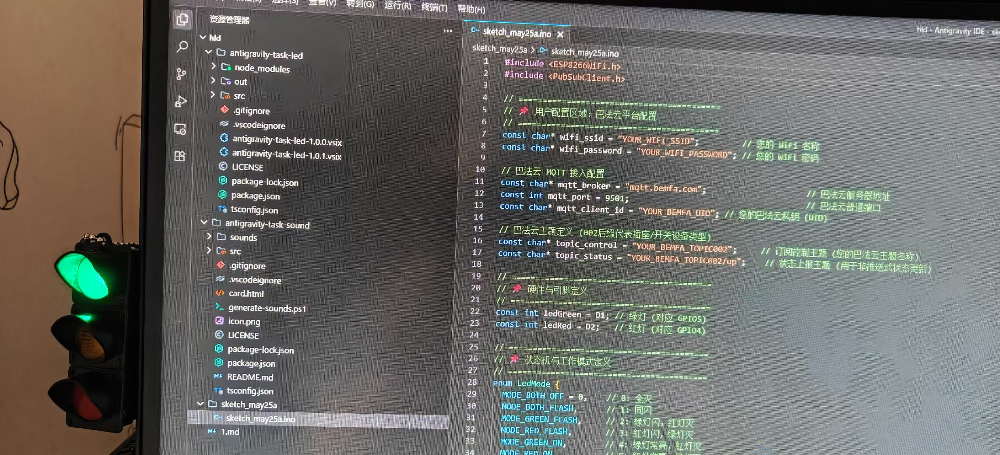
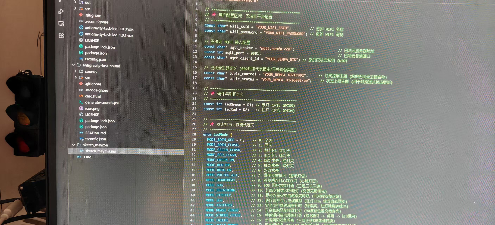
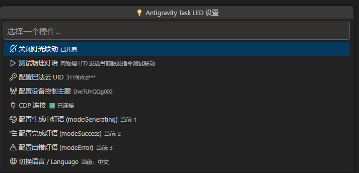

# 🌌 Antigravity Task LED
> **当 AI 在思考，你的桌面也在“呼吸”。**  
> 一套将 Antigravity IDE 里的 AI 思考状态实时映射到桌面物理双色 LED 灯光的物联网联动系统。

---

## 📖 项目简介

**Antigravity Task LED** 是一套极客专属的桌面物理联动系统。它能够实时捕捉 Antigravity IDE（或者 VS Code）中 AI 助手的生成状态，通过轻量级 HTTP API 推送到巴法云物联网平台，进而通过 MQTT 协议广播给摆在您桌面上的 **ESP8266 物理主控芯片**，实时驱动红色与绿色 LED 切换 19 种极其炫酷的非阻塞创意灯语。

无论是沉浸式的太极双鱼呼吸，还是动感的雷达扫描、警车爆闪、医疗心电图仿真，都能让 AI 的智慧和状态在您的物理桌面上立体呈现。

---

## 🎨 核心灯语映射效果

系统原生支持多达 19 种无阻塞灯语。我们为您推荐以下三种核心状态映射方案：

| AI 状态 | 推荐灯语编号与名称 | 物理光影效果 | 极客设计理念 |
| :--- | :--- | :--- | :--- |
| 🧠 **生成中 (Generating)** | `10` **交替柔和呼吸灯** | 绿灯与红灯细腻淡入淡出、此起彼伏 | 模拟 AI 大脑正在高速运转与深度思考 |
| ✅ **生成成功 (Success)** | `16` **太极阴阳双鱼呼吸** | 绿红双灯三阶正弦 $y=\sin^3(x)$ 黏滞消长 | 阴阳相生，象征代码完美融合与收尾 |
| ❌ **生成失败/中断 (Error)**| `5` **红灯常亮** | 绿灯熄灭，红灯保持长明 | 醒目的警示红光，第一时间唤回您的注意力 |

### 📸 物理实物预览

| 🟢 绿灯点亮状态 | 💤 双灯全灭状态 |
| :---: | :---: |
|  |  |

---

## 🏗️ 系统整体架构

整个系统由**软件插件**、**云端中转**和**硬件终端**三部分构成，架构极简、启动飞快：

```
┌─────────────────────────────────┐
│     Antigravity IDE / VS Code   │  ◄─── 实时监测 CDP 控制台 AI 状态
│  (antigravity-task-led 插件插件)   │
└────────────────┬────────────────┘
                 │ 
                 │ 极轻量级 HTTP POST / GET
                 ▼
┌─────────────────────────────────┐
│         巴法云物联网平台          │  ◄─── 接收 HTTP 请求，瞬间转为 MQTT 广播
│         (bemfa.com MQTT)        │
└────────────────┬────────────────┘
                 │
                 │ 实时 MQTT 订阅 (QoS 0)
                 ▼
┌─────────────────────────────────┐
│      ESP8266 物理主控硬件        │  ◄─── 搭载高精度 millis() 无阻塞有限状态机
│      [D1 绿灯]   [D2 红灯]       │       19 种特种灯语实时零卡顿流畅切换
└─────────────────────────────────┘
```

---

## 📁 目录结构说明

本仓库包含完整的硬件端固件与编辑器端插件源码：

```text
.
├── antigravity-task-led/     # Antigravity / VS Code 状态监测插件源码
│   ├── src/                  # 插件核心逻辑（CDP 监视、巴法云 HTTP 推送）
│   ├── package.json          # 插件配置文件
│   └── README.md             # 插件专属使用说明
│
├── sketch_may25a/            # ESP8266 物理主控 Arduino 固件源码
│   ├── sketch_may25a.ino     # 580+行无阻塞状态机核心代码（含19种高级灯语及WiFi/MQTT自动重连）
│   └── secrets.h.example     # 机密信息配置模板（WiFi及巴法云UID隔离）
│
└── README.md                 # 本文件（项目全局总揽说明书）
```

---

## 🔌 硬件准备与接线指南

### 1. 准备材料
* **ESP8266 开发板**（如 NodeMCU / D1 Mini） x1
* **红、绿双色 LED 灯**（或共阴极 RGB LED） x1
* **220Ω 限流电阻** x2（保护 LED，防止瞬间电流过大损坏 GPIO）
* **面包板与杜邦线** 若干

### 2. 接线对照表
本系统采用**高电平点亮**（GPIO 输出 HIGH 时亮灯，引脚安全，上电不闪烁）：

| 物理元器件 | LED 引脚属性 | 接线目标 (开发板引脚) | GPIO 编号 | 作用 |
| :--- | :--- | :--- | :--- | :--- |
| **🟢 绿灯 LED** | 阳极 (长脚) | **`D1`** (经过 220Ω 电阻) | `GPIO5` | 指示生成状态或正常在线状态 |
| **🔴 红灯 LED** | 阳极 (长脚) | **`D2`** (经过 220Ω 电阻) | `GPIO4` | 指示报错、警告或特殊锁定状态 |
| **🔌 公共负极** | 阴极 (短脚) | **`GND`** (或标有 **`G`** 的引脚) | `GND` | 电路公共零电位参考点 |

---

## 🚀 快速上手部署

### 第一步：烧录 ESP8266 硬件固件

1. 安装 **Arduino IDE** 并配置好 ESP8266 开发板环境。
2. 安装 MQTT 客户端库：在 Arduino 库管理器中搜索并安装 **`PubSubClient`**。
3. 打开目录 [sketch_may25a](./sketch_may25a)：
   * 将 `secrets.h.example` 复制一份并重命名为 `secrets.h`。
   * 打开 `secrets.h`，填入您的真实 WiFi 账号密码，以及您在 [巴法云官网](https://bemfa.com) 注册获取的唯一 **UID (私钥)**：
     ```cpp
     #define SECRET_WIFI_SSID "您的真实WiFi名称"
     #define SECRET_WIFI_PASS "您的真实WiFi密码"
     #define SECRET_BEMFA_UID "您的32位巴法云私钥UID"
     ```
   * 打开主文件 `sketch_may25a.ino`，在顶部配置区域确认您的控制主题（例如以 `002` 结尾的巴法云开关主题）：
     ```cpp
     const char* topic_control = "DveTUhQQg002"; // 您的巴法云主题名称
     ```
4. 将开发板通过 USB 接入电脑，在 Arduino IDE 中选择正确的开发板和端口，点击 **上传 (Upload)**。
5. 烧录完成后，打开串口监视器（波特率 `115200`），观察 WiFi 连接和 MQTT 订阅状态。

---

### 第二步：安装并配置编辑器端插件

1. 进入插件目录 [antigravity-task-led](./antigravity-task-led)：
   ```bash
   cd antigravity-task-led
   npm install
   npm run package  # 生成 .vsix 安装包
   ```
2. 在 Antigravity IDE / VS Code 中，打开扩展面板（`Ctrl+Shift+X`），点击右上角 `...` 菜单，选择 **“从 VSIX 安装...”**，导入刚刚生成的 `.vsix` 文件。
3. 重载窗口（`Ctrl+Shift+P` ➡️ `Developer: Reload Window`）。
4. 在 IDE 设置中，配置以下参数：
   * **巴法云 UID (Bemfa UID)**: 填入您的 32 位私钥。
   * **MQTT Topic**: 填入您的设备主题（如 `DveTUhQQg002`）。
   * **状态映射配置**：将 `Generating`、`Success`、`Error` 状态分别映射至您期望的灯语编号（例如：`10`、`16`、`5`）。

配置界面参考：



---

## 🛠️ 19 种丰富灯语完整速查表

您可以通过巴法云发送 `0` 至 `18` 数字指令，或发送 `i<毫秒数>` 动态指令（如 `i300`）随时调节物理灯光表现：

* `0`: **全灭 (Both Off)** —— 静默休眠
* `1`: **同闪 (Both Flash)** —— 基础同频闪烁
* `2`: **绿灯闪，红灯灭 (Green Flash)** —— 单灯提示
* `3`: **红灯闪，绿灯灭 (Red Flash)** —— 单红提示
* `4`: **绿灯常亮，红灯灭 (Green On)** —— 安全、空闲状态
* `5`: **红灯常亮，绿灯灭 (Red On)** —— 报错、警告状态
* `6`: **双灯常亮 (Both On)** —— 全亮展示
* `7`: **红绿警车交替快闪 (Police Alternate)** —— 强警示灯语
* `8`: **科技感心跳双闪 (Heartbeat Pulse)** —— 双灯模拟真实心脏律动
* `9`: **SOS 国际求救信号 (SOS Morse)** —— 三短三长三短高精度摩尔斯序列
* `10`: **交替柔和呼吸灯 (Breathing Alternate)** —— 硬件高精度 PWM 极细腻无级交替呼吸
* `11`: **双萤火虫混沌呼吸 (Firefly Sin)** —— 双通道独立非对称周期浮点正弦，模拟盛夏萤火虫起舞
* `12`: **医疗监护心电波模拟 (ECG Wave)** —— 红灯精确克隆 ECG 波形 (P波, QRS峰, T波)，绿灯脉搏同步暴闪
* `13`: **安全守护摆钟滴答 (Tick-Tock)** —— 绿灯长明，红灯每秒发出 50ms 极短脉冲“滴答”扫过
* `14`: **正余弦相位交错跑马 (Phase Chase)** —— 绿灯为正弦波，红灯为余弦波，90度完美相位差循环跑马
* `15`: **急救爆闪追击爆裂灯语 (Strobe Chase)** —— 绿灯爆闪 3 下 ➡️ 停顿 ➡️ 红灯爆闪 3 下 ➡️ 停顿
* `16`: **太极阴阳双鱼呼吸 (Tai-Chi S-curve)** —— $y = \sin^3(x)$ 三阶正弦，长端强滞留感，极致丝滑
* `17`: **"HELLO" 极客电码广播 (Hello Morse)** —— 高精度以单词 `"H-E-L-L-O"` 摩尔斯码全频段打招呼
* `18`: **科幻雷达扫描与锁定警告 (Radar Lock)** —— 3秒绿灯雷达扫描 ➡️ 1秒红灯高频暴击锁定 ➡️ 0.5秒双灯全亮锁定完成

---

## 🔒 安全合规性承诺
* **零硬编码隐私**：项目完美支持使用 `secrets.h` 进行本地凭据的物理隔离，模板已自动忽略，保证您在 GitHub 上开源时的完全安全。
* **高可靠无阻塞**：硬件端代码中**绝无**任何一处引发死循环或卡死的阻塞 `delay()` 函数，重连与任务交替采用非阻塞定时片切片驱动，可提供工业级的持久稳定运行。

---

## 🤝 鸣谢与贡献
* 本项目依托 **Antigravity IDE** 强大的 AI 开发能力构建。
* 感谢 [巴法云物联网平台 (Bemfa)](https://bemfa.com) 提供极速稳定的云端消息中转服务。

如果您觉得本项目对您的工作桌面提升了科技感，欢迎点一个 **⭐ Star**！如有任何问题或创意灯语建议，欢迎提交 Issue。

---

## 友情链接

感谢 **LinuxDo** 社区的支持！

[](https://linux.do/)
